# Prácticas Angular

**Autor:** David Larriva  
**Carrera:** Ingeniería en Ciencias de la Computación  
**Institución:** Universidad Politécnica Salesiana  

---

## Práctica 04: Estilos y Layout con TailwindCSS
**Fecha:** Mayo 2026

### Diseños Personalizados con Tailwind 
A continuación se presentan 4 distribuciones de layout adicionales exploradas e implementadas utilizando la documentación oficial de TailwindCSS.

#### 1. Grid Asimétrico 
Se utilizó la propiedad `col-span-2` dentro de un contenedor `grid-cols-3` para permitir que ciertos elementos abarquen múltiples columnas, rompiendo la simetría tradicional.
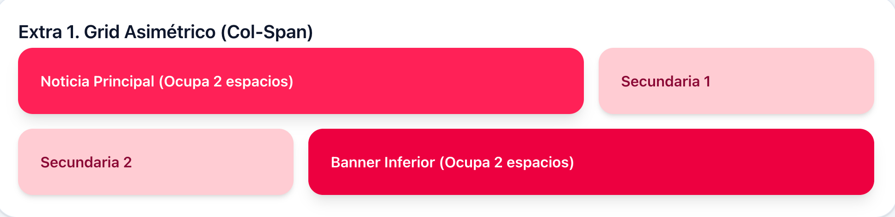

#### 2. Flexbox: Columna Invertida 
Mediante el uso de la clase `flex-col-reverse`, los elementos hijos se renderizan en el orden inverso al que aparecen en el DOM (ideal para chats).
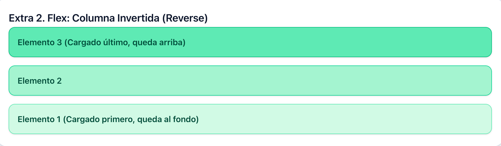

#### 3. Grid: Flujo por Filas 
Se implementaron las clases `grid-rows-3` y `grid-flow-col` para obligar al grid a llenarse de arriba hacia abajo primero.
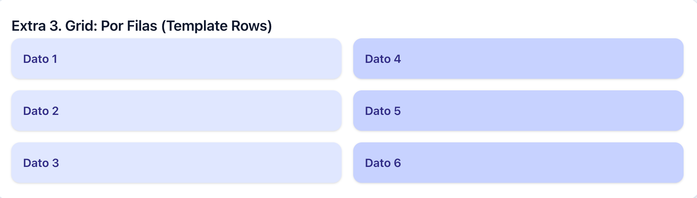

#### 4. Flexbox: Alineación Espaciada y Centrada
Se combinaron las utilidades `items-center` y `justify-between`. Este layout es el estándar para barras de herramientas o tarjetas de usuario.
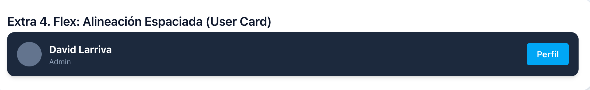

## Práctica 05-A: Formularios Reactivos  
**Fecha:** Mayo 2026

### Objetivo
Desarrollar un formulario de registro en Angular usando `ReactiveFormsModule`, aplicando validaciones síncronas, personalizadas y asíncronas para garantizar el correcto ingreso de datos.

### Funcionalidades Implementadas

#### 1. Validación Asíncrona de Email
Se creó un validador asíncrono (`AsyncValidatorFn`) que simula la verificación de disponibilidad del correo mediante RxJS (`of()` y `delay()`).  
Mientras se valida, el control permanece en estado `PENDING` mostrando un indicador de carga. Si el correo ya existe, se genera el error `emailTaken`.

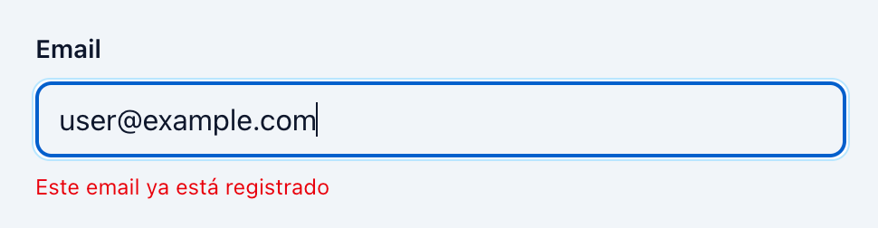

#### 2. Validación de Contraseñas y Manejo de Errores
Se implementó un validador personalizado (`passwordMatchValidator`) para comprobar que `password` y `confirmPassword` coincidan.  
Además, en el método `onSubmit()` se utilizó `form.markAllAsTouched()` para mostrar todos los errores del formulario cuando existan campos inválidos.

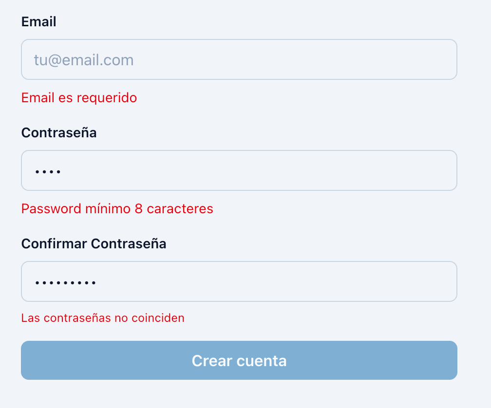

## Práctica 05-B: Reutilización de Código con FormUtils 
**Fecha:** Mayo 2026

### Objetivo de la Práctica
Mejorar el manejo de errores en formularios reactivos mediante una clase auxiliar (`FormUtils`) que centraliza las validaciones y reduce código repetido en el HTML.

### Funcionalidades Implementadas

#### 1. Estado Inicial del Formulario
El formulario de perfil inicia en estado `INVALID` y el botón de envío permanece deshabilitado hasta completar correctamente los campos requeridos.

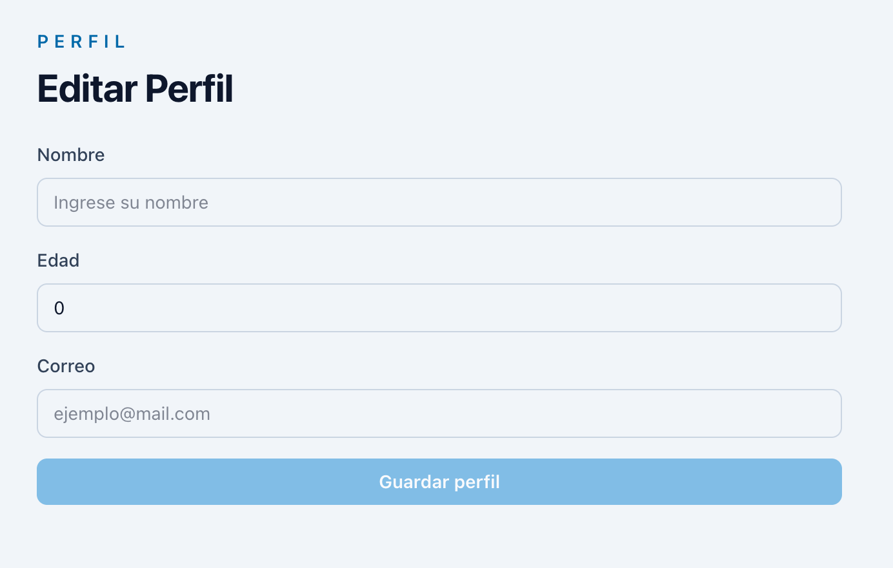

#### 2. Manejo Dinámico de Errores
Con los métodos `FormUtils.isValidField()` y `FormUtils.getFieldError()`, se muestran automáticamente mensajes de error según la validación activa (`required`, `minlength`, `min` o `email`).

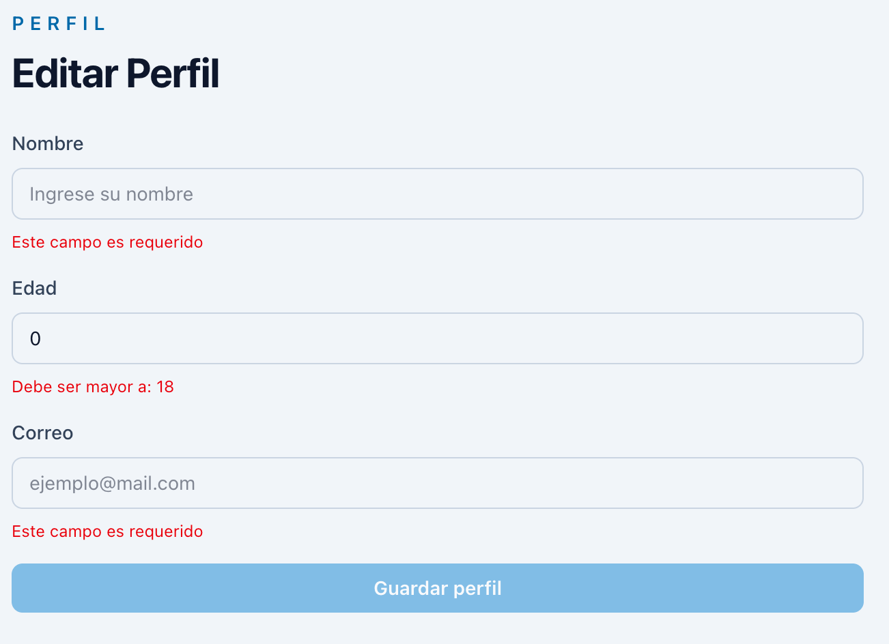
---

## Práctica 05-C: Formularios Dinámicos y Controles Especiales
**Fecha:** Mayo 2026

### Objetivo de la Práctica
Construir una interfaz compleja de configuración que combine la manipulación dinámica de arreglos de controles (`FormArray`) con el manejo de múltiples tipos de inputs nativos y estilizados (Radio buttons, Switches y Checkboxes obligatorios), manteniendo una arquitectura unificada de validación con `FormUtils`.

### Estados del Formulario y Evidencia

#### 1. Formulario Inicial y Valores por Defecto
Carga inicial de la página `/project-config`. Muestra la renderización de los valores predeterminados cargados en el modelo reactivo (como los lenguajes iniciales y el estado del switch), iniciando en estado `INVALID` debido a las restricciones obligatorias pendientes.

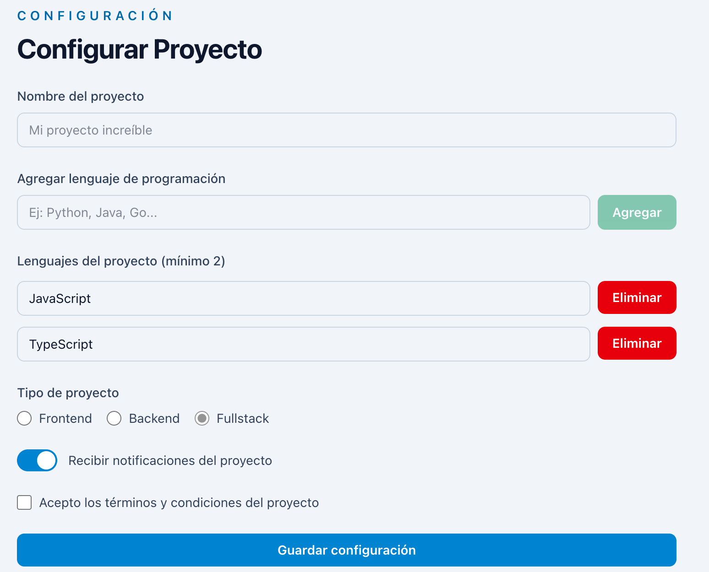

#### 2. Disparo de Alertas Globales de Validación
Vista del formulario tras forzar el submit con campos vacíos o sin cumplir los mínimos establecidos. Se aprecia el funcionamiento heredado de `FormUtils` para capturar errores de longitud mínima en la colección de elementos y la obligatoriedad del checkbox del contrato (`requiredTrue`).

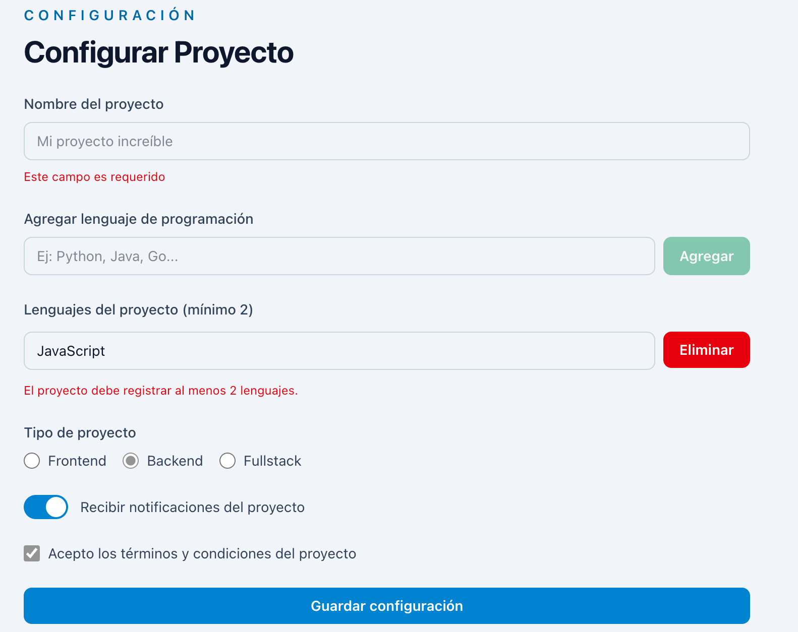

#### 3. Estructura de Datos Válida e Inyección Dinámica
Formulario completamente diligenciado de forma correcta tras agregar nuevos elementos a la colección y marcar las casillas correspondientes, limpiando por completo los hilos de error del DOM.

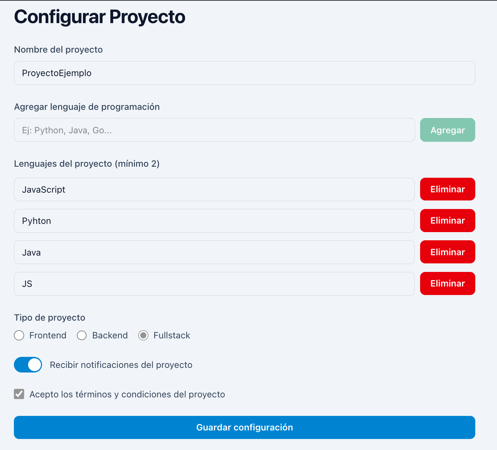

#### 4. Persistencia e Impresión del Modelo de Datos
Captura del log de desarrollo que demuestra la salida estructurada del objeto `myForm.value` en un formato JSON limpio al despachar con éxito el evento `(ngSubmit)`.

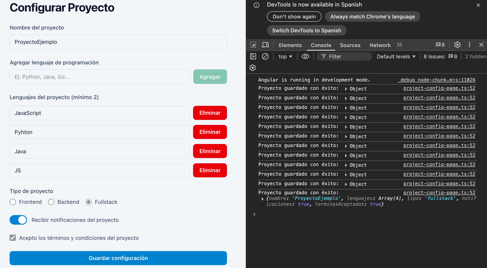

---